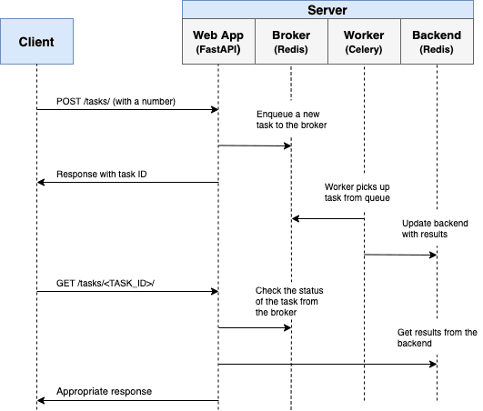

# fastpi_celery
Application of simple Fast API with celery services

# Interaction of Client-API_Broker-Backend




# Commands for running the application from local

## Celery Worker

```bash
(windows) --> celery -A app.tasks worker --pool=solo --prefetch-multiplier=1 --loglevel=info
(linux) --> celery -A app.celery_tasks worker --concurrency=1 --prefetch-multiplier=1 --loglevel=info --logfile=logs/celery.log
```

## Celery Worker - Auto Reloading

```bash
(windows) --> watchmedo auto-restart --directory=./ --pattern=*.py --recursive --  celery -A app.tasks worker --pool=solo --prefetch-multiplier=1 --loglevel=info
(linux) --> watchmedo auto-restart --directory=./ --pattern=*.py --recursive -- celery -A app.celery_tasks worker --concurrency=1 --prefetch-multiplier=1 --loglevel=info --logfile=logs/celery.log
```

## Fast API

```bash
python -m uvicorn app.main:app --reload --workers 1 --host 0.0.0.0 --port 8081
```
## celery task attributes
``` python
>>> from main import celery
>>> from tasks import send_notification
>>> send_notification.delay("123")
<AsyncResult: d2b6118f-c6ac-4f8a-80ce-22a06d9cec5e>   
>>> task = celery.AsyncResult("d2b6118f-c6ac-4f8a-80ce-22a06d9cec5e") 
>>> task.status
'FAILURE' 
>>> task.result
ZeroDivisionError('division by zero')

>>> dir(task)
['forget', 'get', 'get_leaf', 'graph', 'id', 'ignored', 'info', 'iterdeps', 'kwargs', 'maybe_reraise', 'maybe_throw', 'name', 'on_ready', 'parent', 'queue', 'ready', 'result', 'retries', 'revoke', 'state', 'status', 'successful', 'supports_native_join', 'task_id', 'then', 'throw', 'traceback', 'wait', 'worker']
```